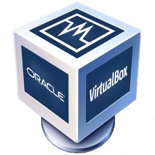

Homework - Class 1
==================

## Join Slack
Slack is the cat's meow for communication and collaboration on a team.  Professional software teams use it, rather than email, to make sure everyone can get the information they need as quickly as possible.  You'll need an invite so, if you don't have an email invite to join *cpcode.slack.com*, shoot me an note with the email address you'd like to use

https://cpcode.slack.com/

## Check System Resources
Let's make sure you'll be able to do the work using the computer you have.  

### On Mac
 * Click on the Apple logo in the upper left corner of your screen
 * Choose *About this Mac*
 * Write down the value shown for *Memory*
 * Click on *Storage*
 * Write down the value shown above the colored bar.  For example: *101GB from of 256 GB*

### On Windows
* Open *Settings/System*
* Click on *About*
* Write down the value for *Installed RAM*
* Click on *Storage*
* Write down the value shown for *This PC*.  For example: *101GB used out of 256 GB*

 > note: If you have less than 50 GB unused in storage, you'll need to free up some space.  Your computer won't run very well without some breathing room

## Install VirtualBox

### What is VirtualBox?

VirtualBox is an *app* that **allows an additional operating system(s) to be installed as a *Guest OS* **. The *guest* behaves as if it were a completely separate computer and has no idea that it lives inside another computer.
This is called *virtualization* and the *guest* is referred to as a *virtual computer* or *virtual machine* and is why the software was named, *"VirtualBox"*.

### Why do this?
 * **Safety**: We're writing software and using tools that can do *anything we want*.  If you make a mistake on your personal computer, it's possible you could do something to require a hard-reset and those are no fun (you'll lose every cat photo you've ever downloaded!).  By creating a *safe environment* inside a virtualization sandbox (yes, we call it a sandbox), that potential hard-reset loses nothing.  You just copy it from your backup copy and it's fixed in seconds.    
 * **Consistency/Flexibility**: Macs, Windows, Linux, oh my!  Not only do we have several completely different kinds of computers and operating systems, we all have done, and will do, different things with them outside of or related to our programming activities.  Using an exact copy of a virtual computer allows us to focus on the code and not fixing, um, issues...  Also, if you want to try some weird software or tool that might be awesome or might completely hose your computer, you can easily make a backup copy of your perfect  virtual computer and try anything you want.  Something goes wrong?  Delete.  No harm, no foul.
 * It's free!  Free as in *freedom* and free as in *no charge*.

[Download and Install VirtualBox](https://www.virtualbox.org/wiki/Downloads)
Choose your Operating System, download and install VirtualBox from Oracle.

[VBox]: vbox_logo.png
